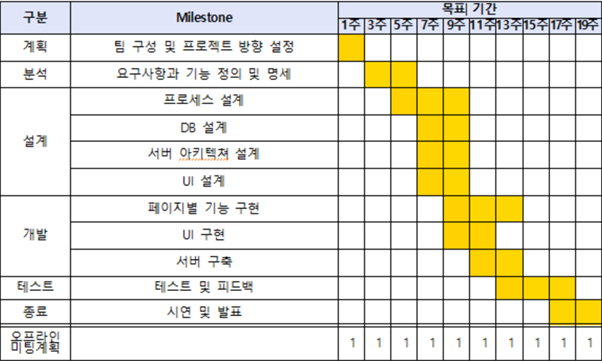
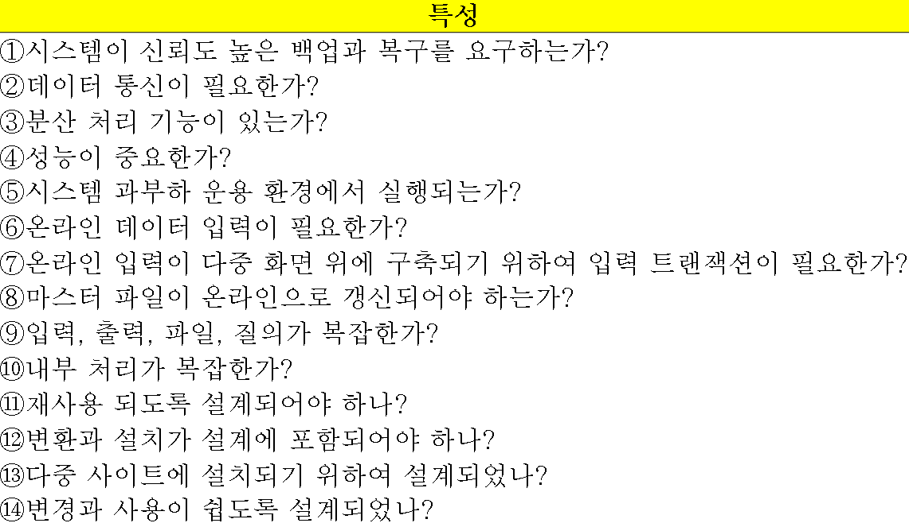

## 프로젝트 이름 
Show mate – (쇼메이트) / (문화행사에 혼자 가는 사람들을 매칭시켜주는 플랫폼)
  

## 프로젝트 목적과 당위성 
사용자가 콘서트, 공연, 이벤트 등 다양한 문화생활을 함께 즐기려는 사람들을 위해 매칭시켜주는 앱이다. 사용자가 예매한 문화행사에서, 같은 행사에 관심 있는 다른 사용자들과 매칭시켜주어 함께 행사를 즐길 수 있다. 1인가구가 증가하고 외로움을 느끼는 현대 사회에서, 이 서비스는 사람들이 새로운 만남을 통해 문화생활을 더욱 풍부하게 경험할 수 있도록 돕는다.

+ **문화 행사 매칭 시스템의 정확한 위치 기반 제공** 
사용자는 지도를 통해 행사내 에서 관심 있는 다른 사용자들의 위치를 정확히 파악할 수 있다. 이를 통해 서로 만나기 쉬운 장소를 선정하여 문화 행사를 함께 즐길 수 있다.  
+ **다양한 문화생활 취향의 사용자 타켓 확보 가능** 
콘서트, 공연, 이벤트 등 다양한 문화 행사에 관심이 있는 사용자를 매칭시켜주므로, 다양한 취향을 가진 사람들을 대상으로 할 수 있다. 이로 인해 다양한 문화 취향의 사용자들이 서비스를 이용할 수 있다.  
+ **문화 행사 경험의 사용자화** 
사용자는 자신이 참여한 문화 행사의 경험을 저장하고 공개함으로써, 같은 행사에 관심 있는 다른 사용자들과의 연결고리를 만들 수 있다. 이를 통해 사람들이 함께 문화생활을 즐기며 새로운 만남을 경험할 수 있는 기회를 제공한다.
  

## 프로젝트의 목표, 범위 및 성공 기준 

+ **로그인** - 사용자가 앱을 실행하면 로그인 화면이 뜨고 회원 가입이 가능하게 한다. 가입이 되어있을 경우, ID/PW 입력을 한 후 로그인을 하거나 틀린 ID/PW에 대한 반응을 하고 사용자가  ID/PW 찾기 기능을 원하면 시스템이 개인정보와의 일치/불일치를 확인하여 로그인 성공한 사용자에 대한 접속 로그를 남기게 하는 것이 목표이자 성공 기준이다.

 + **사용자 매칭** – 사용자가 예매한 티켓을 앱에서 인증함으로써 같은 행사에 관심 있는 다른 사용자와의 매칭이 가능하게 한다. 이 과정에서 사전 범죄예방을 위해 사용자의 인증 정보를 검증하여 안전한 만남 환경을 조성하는 것이 목표이다. 인증된 사용자들 끼리만 매칭되어 서로의 안전을 보장받을 수 있다.

+ **사용자 후기** – 매칭하여 함께 행사를 즐긴 후, 사용자는 그 경험에 대한 후기를 작성할 수 있다. 이 후기는 다른 사용자들이 매칭 시 참고할 수 있는 중요한 정보가 되며, 서비스의 신뢰도를 높이는 역할을 한다. 사용자 간의 소통과 공유를 통해 더욱 풍부한 문화생활 경험을 제공하는 것이 성공 기준이다.

 + **길찾기 기능** – 행사 장소로 가는 길을 안내하는 기능과 더불어, 행사 내에서 매칭된 사용자를 쉽게 찾을 수 있는 기능을 제공한다. 추가적으로 행사장소 내에서도 목적지를 찾을 수 있게 한다. 이를 통해 사용자들은 행사에 참여하기 전과 행사 중에도 원활한 만남을 경험할 수 있다. 행사 참여의 편리성과 만남의 효율성을 높이는 것이 성공 기준이다.

 + **사용자 기반 공연 추천** – 사용자의 관심사를 분석하여 행사를 두 가지 방식으로 추천한다. 첫 번째는 사용자가 문화행사에 3회 이상 참여했을 경우, 그 사용자의 취향과 관심사를 바탕으로 관련된 다른 행사를 추천한다. 두 번째는 사용자가 직접 관심있는 아티스트 또는 행사의 카테고리를 체크할 시, 추천 정보가 인터페이스 상단에 표시되는 방식이다. 이는 사용자의 문화생활을 더욱 활성화시키고, 개인의 취향에 맞는 행사 참여 기회를 제공함으로써 사용자 만족도를 높이는 데 목적이 있다.

+ **채팅** – 매칭된 사용자들은 앱 내에서 채팅을 통해 서로 소통할 수 있다. 이는 행사 전 정보 공유부터, 행사 당일의 만남 조율, 행사 후의 소감 공유까지 다양한 목적으로 활용 가능하다. 사용자 간의 원활한 커뮤니케이션을 지원하여 문화생활의 만족도를 극대화 하는 것이 목표이다.  

## 대략적인 일정 및 마일스톤

  

## 필요 자원 
클라우드 서버, 모바일 기기(Android, iOS), 디자인 / 프론트 / 서버 / DB 각 팀당 3~5명
  

## 예산 예측치
+ **FP(Function Points)**
    * 소프트웨어가 갖는 기능 개수로 소프트웨어 규모와 복잡도를 계산
    * FP = GFP * PCA
  
+ **GFP(Gross Function Point)**
    * 5가지 기능 분야의 개수와 복잡도로 계산
    * GFP = 각 기능분야의 개수 * 복잡도
  
+ **PCA(Processing Complexity Adjustment)**
    * 처리 복잡도 계산표에 의해서 계산
    * 아래 사진의 0~5점을 매기고, PCA = 0.65 + (0.01 * 각 항목점수)
        
        - 0점은 해당 없음, 3점은 보통, 5점은 복잡도 높음
    

||기능분야|개수||복잡도||
|:---:|:---:|:---:|:---:|:---:|:---:|
||||단순|보통|복잡
|**1**|입력|12|3|4|6|
|**2**|출력|11|4|5|7|
|**3**|질의|7|3|4|6|
|**4**|파일|40|8|10|15|
|**5**|인터페이스|4|6|7|10|
  
 
1. GFP = 12 * 3 + 11 * 4 + 7 * 3 + 40 * 8 + 4 * 6 = 445 
2. PCA = 0.65 + 0.01 * 48 = 1.13 
3. FP = GFP + PCA = 445 * 1.13 = 502.85
  

## 팀내 및 경영진에 대한 커뮤니케이션 계획

이해 관계자 및 구성원과 Github를 통하여 소스 코드를 공유
매 주 진행 사항 보고 및 발표 시간을 오프라인으로 가질 예정
디자인 / 프론트 / 서버 / DB 로 나누어짐

	
